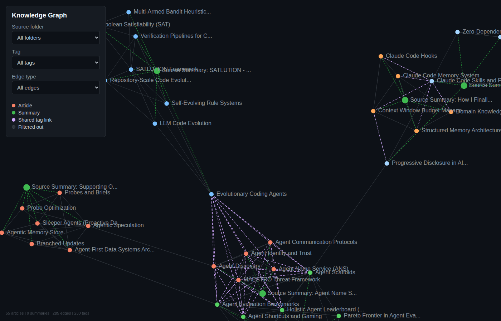

# Personal Knowledge Base

An LLM-maintained knowledge base for Generative AI topics. Inspired by Andrej Karpathy's [LLM Knowledge Bases](https://gist.github.com/karpathy/442a6bf555914893e9891c11519de94f) concept -- raw source material goes in, and an LLM agent compiles and maintains an interlinked wiki of markdown articles organized by source, with a knowledge graph connecting concepts across sources.

No RAG. No vector databases. No embeddings. Just markdown files, a knowledge graph, and an LLM acting as librarian.

## Knowledge Graph

The knowledge graph connects articles across sources via explicit cross-references and shared tags. It is rebuilt automatically after every ingestion.



The [interactive version](wiki/graph.html) is a self-contained D3.js force-directed graph with filtering by source folder, tag, and edge type. Nodes are color-coded by source, and edges come in three types: related (explicit cross-references), shared-tag (auto-generated between articles in different folders sharing 2+ tags), and source (article to its summary).

## Prerequisites

- Python 3.11+
- [uv](https://docs.astral.sh/uv/) package manager
- [Claude Code](https://docs.anthropic.com/en/docs/claude-code) CLI (for the LLM agent operations)

## Setup

```bash
# Clone the repo
git clone <repo-url>
cd personal-knowledge-base

# Install dependencies
uv sync
```

## Project Structure

```
personal-knowledge-base/
├── CLAUDE.md              # Schema and instructions for the LLM agent
├── build_graph.py         # Generates wiki/graph.json and wiki/graph.html
├── changelog.md           # Log of every ingest/update run
├── clip.sh                # URL-to-markdown ingestion script
├── pyproject.toml         # Python dependencies (trafilatura, markitdown)
├── docs/
│   └── img/               # Screenshots and diagrams
├── raw/                   # Source documents (append-only, never edit)
│   └── YYYYMMDD-source-slug.md
├── wiki/                  # LLM-authored articles organized by source
│   ├── index.md           # Master index of all articles by category
│   ├── graph.json         # Knowledge graph (nodes + edges)
│   ├── graph.html         # Interactive D3.js visualization
│   └── <source-slug>/     # One folder per ingested source
│       ├── summary-<source-slug>.md   # Source summary at configured depth
│       ├── concept-one.md             # Wiki article
│       └── concept-two.md             # Wiki article
└── .claude/
    └── skills/            # Claude Code skill definitions
        ├── add/           # /add <url> -- clip + ingest in one command
        ├── ingest/        # /ingest -- batch process unprocessed raw files
        ├── query/         # /query -- search by tags and keywords
        └── lint/          # /lint -- health check for broken links, gaps
```

## Adding Content

### One-command add (recommended)

The `/add` skill clips a URL to `raw/` and ingests it into wiki articles in a single operation:

```
/add https://arxiv.org/pdf/2510.11977
/add https://www.anthropic.com/news/contextual-retrieval
/add https://youtu.be/Axd50ew4pco
```

The depth level for source summaries is configurable (stored in `.claude/skills/add/config.json`):

| Level | Style | Word Count |
|-------|-------|------------|
| 100   | Explain like I'm 12 (Feynman technique, analogies) | 300-600 |
| 300   | College level (technical but accessible) | 500-800 |
| 500   | Expert deep-dive (full technical detail) | 800-1200 |

### Clip URLs directly

```bash
# Web article or blog post (uses trafilatura)
./clip.sh https://www.anthropic.com/news/contextual-retrieval

# PDF document (auto-detected, uses markitdown)
./clip.sh https://arxiv.org/pdf/2501.00663

# YouTube video (auto-detected, uses markitdown for transcript)
./clip.sh https://youtu.be/Axd50ew4pco

# Custom slug for cleaner filename
./clip.sh https://some-long-url.com/article my-custom-slug

# Bulk clip from a file (one URL per line, # for comments)
./clip.sh --bulk urls.txt
```

### Batch ingest

After manually placing files in `raw/`, run the `/ingest` skill to process all unprocessed files:

```
/ingest
```

## Ingestion Pipeline

The `/add` skill runs three phases:

1. **Clip** -- Downloads the URL to `raw/YYYYMMDD-source-slug.md` using trafilatura (web) or markitdown (PDF/YouTube)
2. **Ingest** -- The LLM reads the raw file, extracts 3-10 key concepts, creates a source folder `wiki/<source-slug>/` with individual wiki articles and a depth-configured summary with ASCII diagrams
3. **Link** -- Adds cross-references between new and existing articles, rebuilds the knowledge graph via `build_graph.py`, updates `wiki/index.md` and `changelog.md`

## Ingestion Tools

| Tool         | Best For                                | Image Download |
|--------------|-----------------------------------------|----------------|
| trafilatura  | Web articles, blog posts (clean output) | No             |
| markitdown   | PDFs, DOCX, YouTube transcripts         | No             |

- **trafilatura** strips boilerplate (navbars, ads, footers) and extracts the main article content
- **markitdown** converts the full page/document to markdown, handles non-HTML formats well
- Neither tool downloads images -- they preserve image URLs as markdown `` references

## Knowledge Graph

The knowledge graph (`wiki/graph.json`) is rebuilt after every ingestion by running:

```bash
uv run python build_graph.py
```

This generates two files:
- `wiki/graph.json` -- structured graph with nodes (articles, summaries) and edges (related, shared-tag, source)
- `wiki/graph.html` -- self-contained D3.js interactive visualization (works standalone, no server needed)

### Edge types

| Type | Source | Description |
|------|--------|-------------|
| `related` | Explicit `related:` links in frontmatter | Direct conceptual relationships between articles |
| `shared-tag` | Auto-generated by `build_graph.py` | Connects articles in different source folders sharing 2+ tags |
| `source` | Auto-generated by `build_graph.py` | Links each article to its source folder's summary |

### Visualization features

- Force-directed layout with zoom, pan, and drag
- Filter by source folder, tag, or edge type
- Hover highlights connected nodes
- Color-coded by source folder (articles) and type (summaries)
- Click opens the article file

## Wiki Article Format

Each article follows this structure with YAML frontmatter:

```markdown
---
title: Concept Name
created: 2026-04-08
updated: 2026-04-08
sources: [raw/filename.md]
related: [Other Article](other-article.md), [Cross Folder](../other-folder/article.md)
tags: [concept-tag, broader-topic-tag, category-tag]
---

# Concept Name

Encyclopedia-style summary (200-500 words)...

## Key Points
- ...

## Related Concepts
- [Other Article](other-article.md) - brief note on relationship

## Sources
- raw/filename.md - what this source contributed
```

### Tags

Every article has 3-7 lowercase-kebab-case tags serving two purposes:
1. **Content-specific tags**: what this article covers (e.g., `pki`, `pareto-frontier`, `tacit-knowledge`)
2. **Broader topic tags**: the larger area it belongs to (e.g., `ai-agents`, `software-engineering-philosophy`, `benchmarking`)

Tags drive the shared-tag edges in the knowledge graph, automatically connecting related concepts across different sources.

## Source Summary Format

Each source gets a summary at the configured depth level with required ASCII diagrams:

```markdown
---
title: "Source Summary: Paper Title"
created: 2026-04-08
source: raw/filename.md
depth: 500
articles_created: [article-one.md, article-two.md]
---

# Paper Title - Summary

<Summary at configured depth level>

## What This Source Covers
- ...

## Wiki Articles From This Source
- [Article One](article-one.md) - one line description
```

## Naming Conventions

| Item | Convention | Example |
|------|-----------|---------|
| Raw files | `YYYYMMDD-source-slug.md` | `20260408-arxiv-2510-11977.md` |
| Source folders | `wiki/<source-slug>/` | `wiki/arxiv-2510-11977/` |
| Wiki articles | `wiki/<source-slug>/lowercase-kebab-case.md` | `wiki/arxiv-2510-11977/agent-scaffolds.md` |
| Source summaries | `wiki/<source-slug>/summary-<source-slug>.md` | `wiki/arxiv-2510-11977/summary-arxiv-2510-11977.md` |
| Cross-references | `[text](file.md)` or `[text](../folder/file.md)` | `[Agent Scaffolds](agent-scaffolds.md)` |

## Skills

| Skill | Description |
|-------|-------------|
| `/add <url>` | Clip URL to raw/ and ingest into wiki articles in one command |
| `/ingest` | Batch process all unprocessed files in raw/ |
| `/query <question>` | Search by tags and keywords, synthesize answer with references |
| `/lint` | Health check: broken links, missing articles, stale backlinks, folder structure |

## Topic Coverage

This knowledge base covers Generative AI and related topics:

- LLM Fundamentals (transformers, attention, tokenization)
- Prompt Engineering
- Retrieval-Augmented Generation (RAG)
- AI Agents and Agentic Frameworks
- Fine-Tuning and Training
- Guardrails and Responsible AI
- Benchmarking and Evaluation
- GenAI Applications and Tools
- Cloud AI Services (Amazon Bedrock)
- Software Engineering Philosophy
- Economics of Organization

## References

- Karpathy's idea file: https://gist.github.com/karpathy/442a6bf555914893e9891c11519de94f
- trafilatura docs: https://trafilatura.readthedocs.io
- markitdown repo: https://github.com/microsoft/markitdown
